# Clarified Chaos FX — AEGIS Master Brain

## Purpose

This is the canonical knowledge file for the Clarified Chaos FX hub. It places the executable AEGIS strategy first, followed by course architecture, risk, psychology, examples, journaling, research, and change control.

## Phase 0 Execution Playbook - Active Rules

These are the active, user-defined Phase 0 execution rules. For a Phase 0 review, they take priority over any more general or conflicting course language below. They define whether a setup is eligible for review; they do not authorize a live trade.

### Condition and model selection

- **Ranging:** only assess a reversal at an established range extreme. The intended target is the middle of that range.
- **Trending:** only assess continuation after a pullback of more than 50% of the prior extension.
- **Trending range:** assess either defined reversal or defined continuation; do not blend them into an undefined third model.

### Required confirmation and target logic

- Every eligible model needs a **Type 3 lower-timeframe shift**. No Type 3 shift means no trade. A bullish Type 3 first breaks a prior high, immediately breaks the previous low, then pulls back to 50% of that structure-breaking impulse. A bearish Type 3 is the inverse: first break a prior low, immediately break the previous high, then pull back to 50% of that impulse.
- **Trending-range reversal:** price must extend above the previous high in a bullish case, or below the previous low in a bearish case. After the Type 3 shift, the target is 50% of the extension that moved beyond that previous structure.
- **Trending-range continuation:** price must be in the 50%-75% pullback zone of the prior extension before the Type 3 shift is assessed.
- **Ranging reversal:** target the midpoint of the established range, only when that target leaves reasonable reward relative to risk.
- **Trending continuation:** require reasonable room to the next opposing structure after confirmation.

### Hard no-trade gates

- The condition or offered model is unclear.
- Price is too extended or trending too hard to provide a pullback entry.
- There is no Type 3 lower-timeframe shift.
- There is not enough room for a reasonable reward-to-risk target.

When a screenshot cannot prove a required location, pullback depth, shift, or room to target, label the evidence insufficient rather than assuming the rule passed.

## Evidence States

- **CONFIRMED:** Explicitly taught, repeatedly demonstrated, or user-approved.
- **INFERRED:** Strong reconstruction from repeated evidence.
- **DISCRETIONARY:** Subjective but bounded by the framework.
- **PROVISIONAL:** Useful evidence awaiting approval, testing, or fuller definition.
- **DEFERRED:** Referenced but not sufficiently defined.
- **CONFLICT:** Competing evidence requiring change control.

Not every judgment requires a score or fixed threshold. Range cleanliness, arrival quality, sufficient extension, participation, correlation weighting, usable range size, and entry-method selection may remain discretionary.

Never silently upgrade an inference. Separate instructor statements, demonstrated rules, Archive reconstructions, and approved AEGIS rules.

## Visual Source Convention

Screenshots are embedded beside the rules they support. Each caption identifies the source lesson and timestamp when available. The images are evidence and illustration; captions and Archive interpretations remain separate from the literal source.

A machine-readable map is included at `source_index.json`. All paths are relative so the folder can be moved directly into the Codex hub.

---

# 1. AEGIS Strategy

## 1.1 Identity

AEGIS is a condition-dependent **Counter-Behavior Reversal (CBR)** system.

A CBR reverses an immediate counter-direction sequence from a condition-appropriate location. It may rejoin the broader direction, reverse from a range extreme, or produce a stricter counter-direction correction inside a trending range.

```text
CONDITION
→ LOCATION
→ COUNTER-SEQUENCE
→ TIMING
→ STRUCTURAL REVERSAL
→ ENTRY
→ INVALIDATION
→ CONDITION-BASED TARGET
```

A CBR is not simply any structural shift.

## 1.2 Four Questions

> **Visual source — Final Integration, 00:38.** The course skill tree routes market structure, auction-market theory and candle behavior into the What–Where–How–When process.

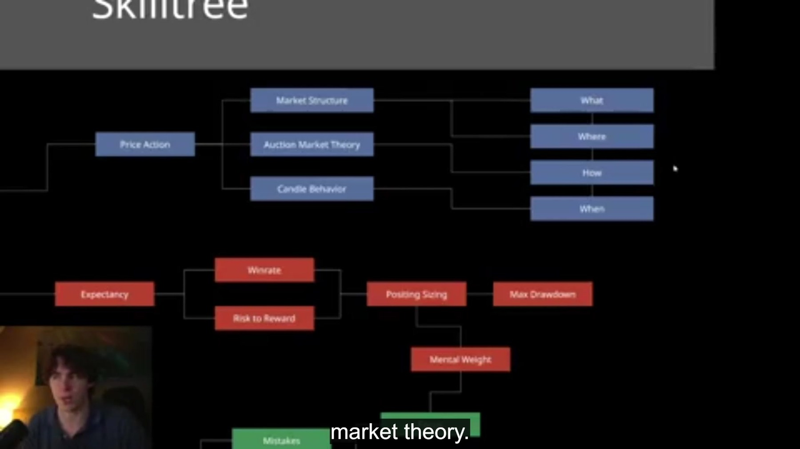

### WHAT
- Broad direction
- Middle-duration condition
- Continuation, correction, or reversal
- Pro-direction or counter-direction model

### WHERE
- Relative location in active move/range
- 25%, 50%, or 75% area
- Correct half or outer quarter
- Relevant high/low, prior CBR, level, or AOI

### HOW
- Quality of the counter-sequence into location
- Clean versus messy
- Fast/high-participation versus slow/grindy
- Sufficient extension and duration
- Meaningful prior structure taken

### WHEN
- Session and time into hour
- Hourly, 30-minute, and 15-minute candle phase
- Initial structural shift
- T2 or another approved entry model

## 1.3 Explicit Course Checklist

> **Literal checklist source — Example 3 Part 1, 06:40.** This screenshot is the source of truth for the written labels, including **20m OE** and **22–52**.

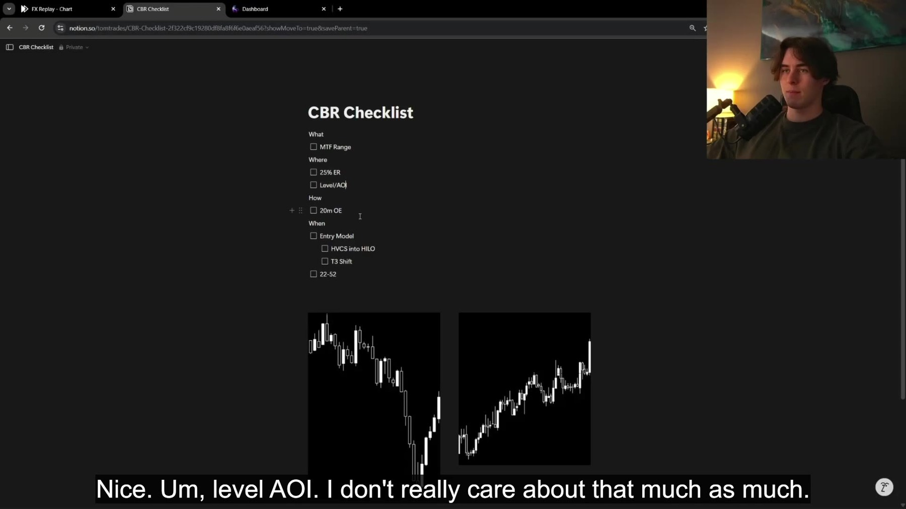

```text
WHAT
• MTF Range

WHERE
• 25% ER
• Level/AOI

HOW
• 20m OE

WHEN
• Entry Model
• HVCS into HI/LO
• T3 Shift
• 22–52
```

Operational meaning:

- **MTF Range:** Middle-duration range or trending range identified through repeated rotation.
- **25% ER:** Operate near the outer quarter of the structure.
- **Level/AOI:** Optional refinement; not the foundation.
- **20m OE:** Roughly twenty minutes of meaningful counter-direction overextension.
- **HVCS into HI/LO:** High-participation candle sequence into meaningful high/low structure.
- **T3:** Phase 0 lower-timeframe sequence: take the prior high/low, immediately break the opposing prior swing, then pull back to 50% of the structure-breaking impulse.
- **22–52:** Later-hour CBR window shown in Example 3; timing-protocol refinement remains provisional until approved.

## 1.4 Direction and Condition

> **Visual source — Condition vs Direction, 03:07.** Direction and condition are shown as separate analytical dimensions.

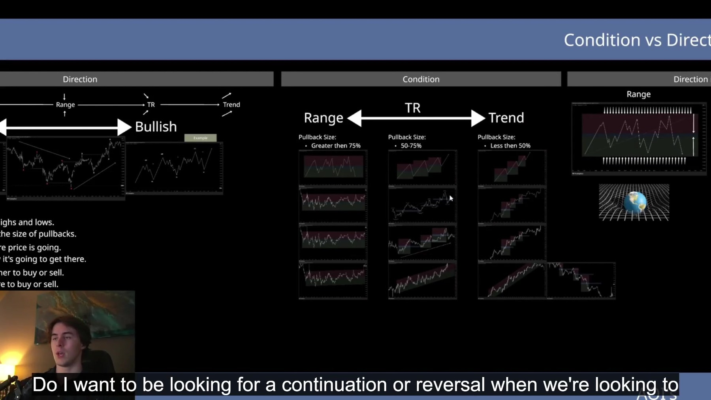

Direction tells which way structure is progressing.

Condition tells how price is progressing.

### Range
- Pullbacks commonly exceed 75%.
- Price rotates between extremes.
- Trade from an extreme toward balance.

### Trending Range
- Pullbacks commonly occupy 50–75%.
- Price rotates with directional drift.
- Strongest setups are normally pro-direction from the aligned side.
- Counter-direction corrections require clearer overextension and stricter confirmation.

### Trend
- Pullbacks commonly remain below 50%.
- Continuation can be traded around 25%.
- Trend is tradable; “do not trade trend” was instructor specialization, not a universal rule.

## 1.5 Range Qualification

> **Visual source — Condition vs Direction, 04:59.** The course explicitly defaults to no trade when the condition cannot be identified clearly.

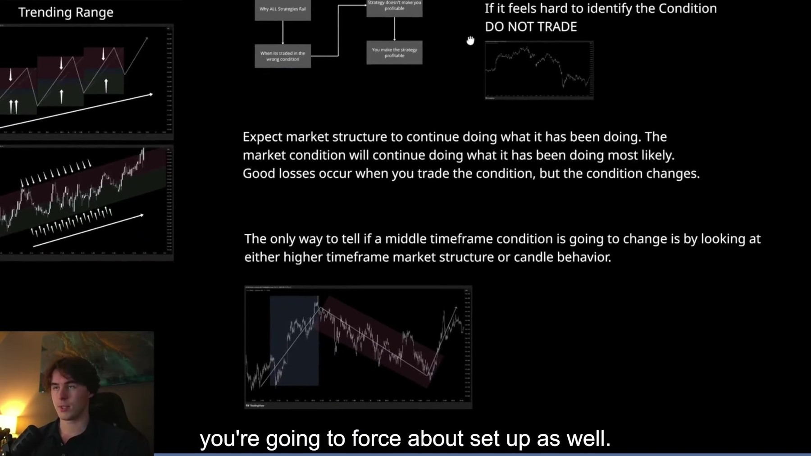

A range is defined by rotational behavior, not merely sideways appearance or fixed duration.

Consider:
- Repeated correction toward balance
- Clear extremes
- Usable size
- Structural cleanliness
- Lack of sustained directional expansion

Reject ranges that are too large, unstable, grindy, internally directional, recently broken, or poorly rotational.

This is discretionary but framework-bounded.

## 1.6 Location and the Three 50%s

### AOI-50
50% of the broader move or range. Used for location.

### Entry-50
50% pullback of the structure-breaking impulse. Used for entry.

### Target-50
50% of the prior move or range. Used as the expected correction destination.

Never merge them.

Broad relativity:
- 25% = shallow continuation area
- 50% = middle
- 75% = deep pullback/extreme

CBRs generally operate near the appropriate outer half or quarter, often after a prior high/low is taken.

Levels refine location but do not create the setup:

```text
Condition
→ AOI
→ Relevant level
→ Reaction
→ Entry model
```

## 1.7 Arrival / Counter-Sequence

Preferred:
- Clear counter-direction movement
- Meaningful duration
- Sufficient extension
- High participation or decisive candles
- Prior high/low taken
- Clean path into location

Lower quality:
- Slow overlapping grind
- Short or weak extension
- No meaningful structure taken
- Late reaction
- Messy movement without clear behavior to reverse

Course examples often use roughly twenty minutes of counter-extension. Time alone is insufficient; extension quality still matters.

## 1.8 Candle Timing

> **Visual source — Candle Behavior, 01:14.** Candles are taught as compressed structure that communicates control, rejection and commitment.

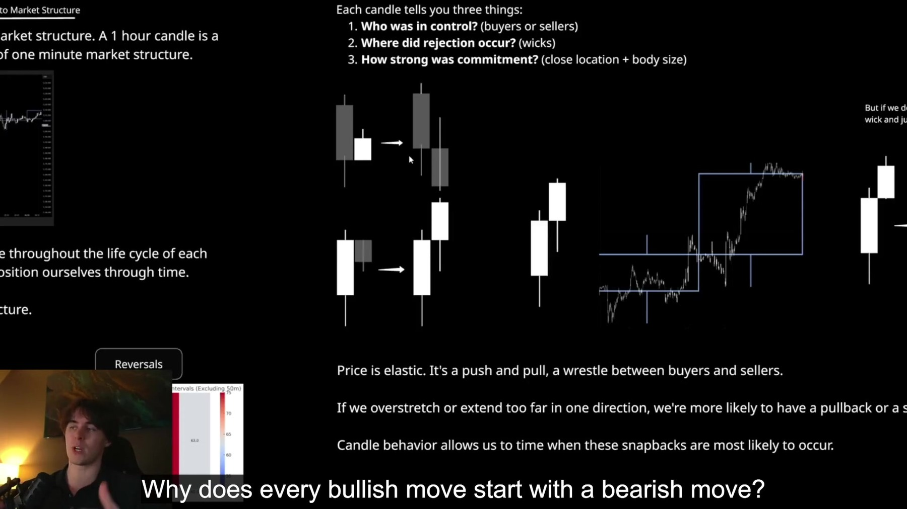

> **Visual source — Candle Behavior, 12:21.** The course instructs the trader to think in durations of price, not only conventional timeframe labels.

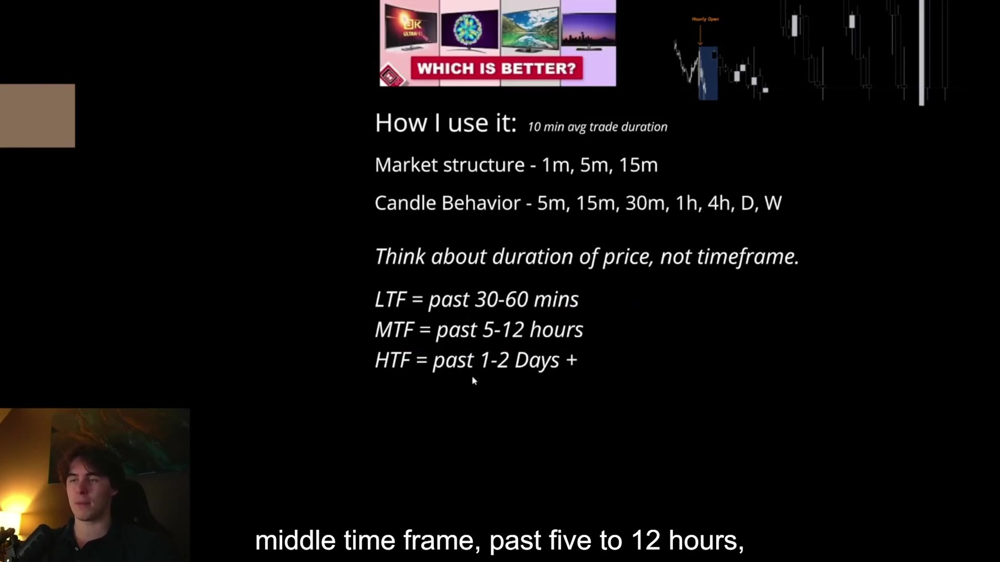

Confirmed broad model:
- 0–15 minutes can favor continuation in directional/high-participation conditions.
- Around 30 minutes can favor reversal in rangebound/lower-participation conditions.

Example 3 supplies stronger CBR evidence for approximately **22–52 minutes into the hour**. Treat this as a pending refinement until approved.

Multi-duration alignment can be:

```text
Late in hourly candle
+ Early in new 30-minute or 15-minute candle
+ Lower-timeframe structural transition
```

A bullish candle often forms a lower wick before expansion. A bearish candle often forms an upper wick before expansion.

Best aligned longs often form below the candle open. Best aligned shorts often form above it.

Candle behavior tells when to seek the shift; it does not replace the shift.

## 1.9 Structural Shift

Bearish reversal:

```text
Bullish structure
→ Prior high taken
→ Relevant prior low clearly and decisively broken
→ Bearish structure
```

Bullish reversal is the inverse.

The break must be meaningful and followed through. A marginal breach is insufficient. ChoCh is a warning, not complete confirmation.

## 1.10 T2 — Confirmed

> **Visual source — Example 2 Part 2, 04:00.** The instructor explicitly says “the second shift” while waiting for the nested high to be removed.

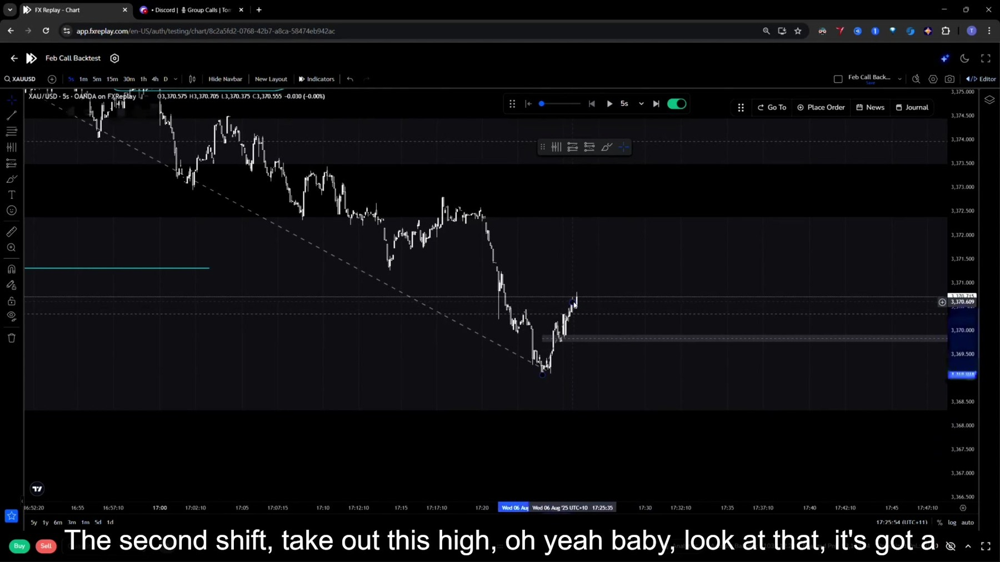

> **Supporting source — Entry Model, 02:35.** The course diagram distinguishes a larger shift from a nested fractal shift.

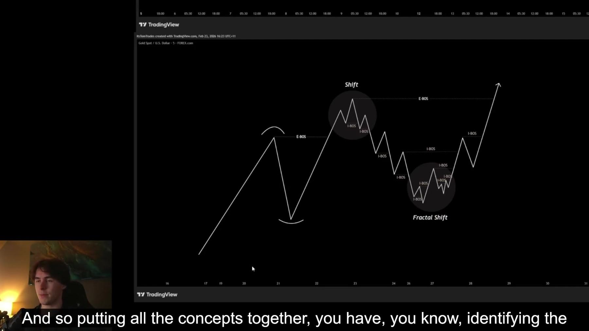

T2 is a second nested structural shift that forms after an initial directional shift and subsequent pullback, commonly near the 50% area of the initial shift. It provides additional confirmation and may supply a refined breakout or pullback entry.

```text
Initial shift
→ Pullback, commonly near Entry-50
→ Second nested shift
→ Refined breakout or pullback entry
```

T2 refines entry but does not automatically define the stop. Invalidation may remain beyond the larger swept or reaction extreme.

## 1.11 T3 — Phase 0 Definition

T3 is a directional lower-timeframe market-structure shift. It is not a generic break of structure.

- **Bullish T3:** price takes a prior high, then immediately breaks the previous low, then pulls back to 50% of that structure-breaking impulse.
- **Bearish T3:** price takes a prior low, then immediately breaks the previous high, then pulls back to 50% of that structure-breaking impulse.

The required order is take extreme, immediately break the opposing swing, then pull back to the 50% level. A missing step, reversed order, or structure that cannot be identified in the evidence is not a confirmed T3.

Do not equate T3 with T2. T2 remains a nested second-shift refinement; T3 is the Phase 0 confirmation sequence above.

## 1.12 Entry Variants

### Entry-50
Preferred more often when the shift is relatively large, the breakout would be late, or better geometry is needed.

### Refined Breakout
Valid when structure is small/clean and candle behavior supports immediate expansion.

### Market Entry
Lower quality when the preferred retracement is still likely. Example 3 shows a premature market entry losing before the preferred 50% appeared.

Entry selection remains discretionary but bounded by structure, candle phase, condition, stop, target, and resulting RR.

## 1.13 Stop

Correct order:

```text
Structural invalidation
→ Stop with breathing room
→ Permitted risk
→ Position size
```

Possible invalidation:
- Beyond swept low for long
- Beyond swept high for short
- Beyond larger reaction extreme
- Beyond scale-consistent structural boundary

Do not force a stop to manufacture RR. A nested T2 stop may be too tight if it sits inside normal rotation.

## 1.14 Target

Targets come from condition:
- Target-50
- Previous internal high/low
- Opposing structural region
- Conservative correction target for counter-direction trade

Correct order:

```text
Condition-derived destination
→ Target
→ Calculate resulting RR
→ Accept or reject
```

Do not extend targets merely to create attractive advertised RR.

## 1.15 Progression and Management

After entry, identify the nearest meaningful high/low that must break.

```text
Long → progression high must break
Short → progression low must break
```

Failure to progress can reduce setup quality.

Potential deterioration:
- Hard rejection at progression level
- Sideways behavior
- Declining participation
- Correlation contradiction
- Failure to expand in expected candle phase

Time-to-expansion is a quality diagnostic, not yet a hard invalidation rule.

Candle behavior continues after entry.

## 1.16 Correlation

Correlation may grade quality before entry and confirm progression after entry.

Gold example hierarchy:
1. Gold’s own structure and location
2. Gold breadth/spread
3. DXY as additional evidence

Imperfect DXY alignment may reduce quality without invalidating stronger gold-specific evidence. Weighting remains discretionary.

## 1.17 No-Trade Conditions

Pass when:
- Condition is unclear
- Price is in the middle
- Market is strongly trending against the intended reversal
- Range has broken
- Arrival is slow/grindy
- Counter-extension is insufficient
- Reaction is too late
- Required pullback never occurs
- Break is marginal
- Only ChoCh exists
- Resulting RR fails the tested acceptance filter
- Risk or shutdown rules prohibit entry

Missed pullback:

```text
Required entry not offered
→ Mark MISSED
→ Do not chase
```

---

# 2. Decision Engine

## 2.1 Master Flow

```text
Identify relevant duration
→ External/internal structure
→ WHAT: direction, condition, objective
→ WHERE: correct half/quarter and AOI
→ HOW: meaningful counter-sequence and arrival quality
→ WHEN: candle timing and structural confirmation
→ Initial shift
→ T2 when required
→ Select entry variant
→ Structural stop
→ Condition-based target
→ RR acceptance
→ Risk/daily-limit check
→ Execute
→ Monitor progression, candle behavior, and invalidation
```

## 2.2 Trade States

- NO TRADE
- DEVELOPING SETUP
- TRADE
- MANAGE
- INVALIDATED
- MISSED
- REVIEW

## 2.3 CBR Test

```text
Clear condition?
  No → Not a CBR
  Yes →
Correct location?
  No → Not a CBR
  Yes →
Meaningful counter-sequence?
  No → General structure play at best
  Yes →
Confirmed reversal?
  No → Developing CBR
  Yes → CBR candidate
```

## 2.4 Counter-Direction Test

```text
Trending range rather than clean trend?
→ Opposite extreme reached?
→ Significant high/low taken?
→ Meaningful overextension?
→ Clear reversal model?
```

A counter-direction setup requires stricter evidence.


# 3. Risk Governance

## 3.1 Priorities

> **Visual source — The Maths of Winning, 01:35.** Capital protection and drawdown control are placed before maximizing return.

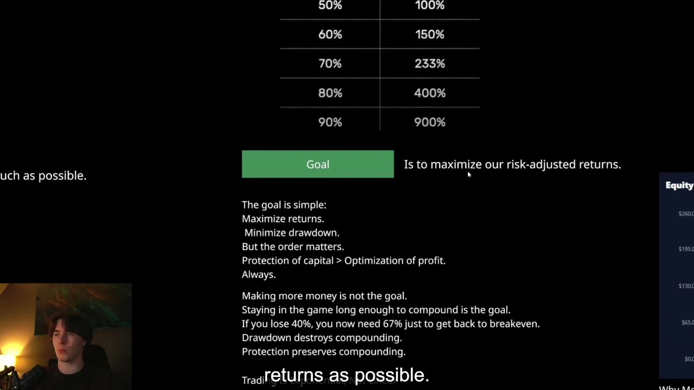

1. Protect capital
2. Minimize drawdown
3. Preserve compounding
4. Optimize profit

## 3.2 Core Formulas

```text
Expectancy = (WR × Average Win) − (Loss Rate × Average Loss)
Profit Factor = Gross Profit ÷ Gross Loss
Breakeven WR = 1 ÷ (1 + R)
```

Position sizing:

```text
Risk Amount = Equity × Risk %
Position Size = Risk Amount ÷ (Stop Distance × Unit Value)
```

## 3.3 Risk Principles

- No universal risk percentage
- Risk capacity depends on full distribution, variance, drawdown, psychology, frequency, and external rules
- Simulator outputs are estimates, not guarantees
- Higher validated win rate may support higher size only when the full distribution is considered
- Position size is mental weight and can change realized behavior
- Scale capital before forcing risk or frequency

## 3.4 Prop Accounts

For prop environments, usable risk is constrained by external drawdown rules and psychological tolerance. External rules override modeled capacity.

## 3.5 Sizing Modes

Keep separate:
- Fixed fractional risk
- Initial-balance normalized replay risk
- Fixed-dollar live risk

Do not infer that one example’s test setting is the mandatory live model.

## 3.6 Frequency

> **Visual sources — Trade Frequency.** The instructor recommends limiting both trade count and session exposure, then precommitting a daily loss boundary.

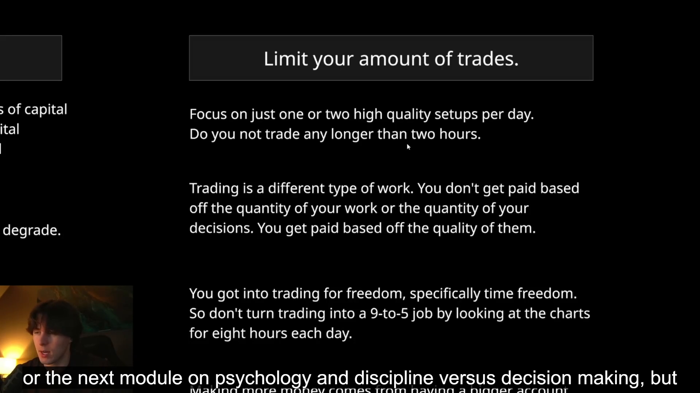

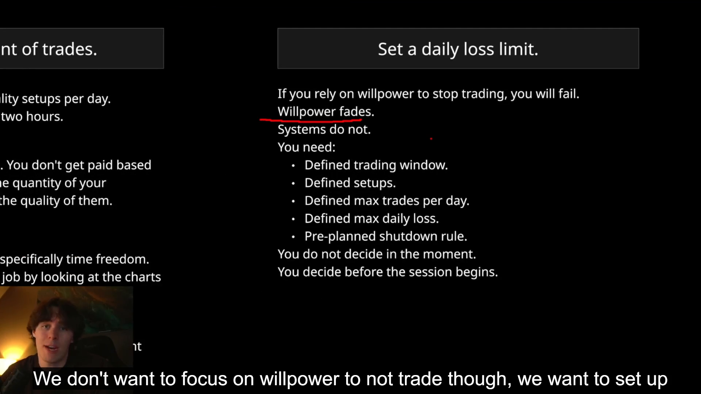

Frequency consumes monetary and mental capital.

Course defaults:
- Roughly 1–2 high-quality setups per day
- Generally no more than two hours
- Maximum trades
- Maximum daily loss
- Preplanned shutdown

Exact limits require validation.

Shutdown protects execution from tilt; it does not mean the next trade is statistically less likely to win.

## 3.7 Scale-Ins — Not Approved

Before adoption define:
- Maximum combined idea risk
- Risk per tranche
- Maximum entries
- Shared/separate invalidation
- Confirmation for each entry
- Whether adding in drawdown is allowed
- Frequency counting
- Management across tranches

## 3.8 Two Attempts — Not Approved

Instructor sometimes gives an idea two attempts.

Before adoption define:
- Total setup-risk budget
- Attempt 1 and Attempt 2 risk
- Whether Attempt 1 may be a full loss
- Thesis conditions required to remain valid
- Improvement required for re-entry
- Daily trade and loss-limit impact

## 3.9 Drawdown Recovery

> **Visual source — The Maths of Winning, 11:06.** Losing-streak estimates illustrate variance and should not be treated as exact forecasts.

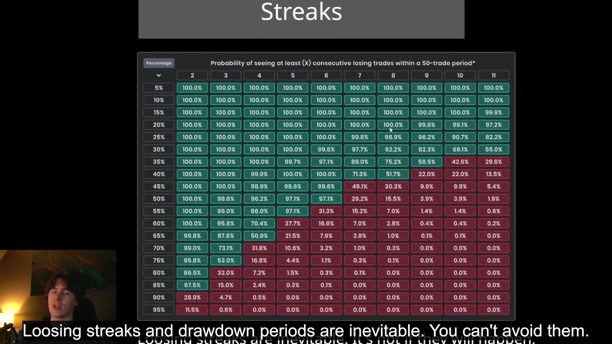

| Drawdown | Recovery Needed |
|---:|---:|
| 5% | 5.3% |
| 10% | 11.1% |
| 20% | 25% |
| 30% | 43% |
| 40% | 67% |
| 50% | 100% |
| 60% | 150% |
| 70% | 233% |
| 80% | 400% |
| 90% | 900% |

## 3.10 Planned, Realized, and Hindsight RR

Track separately:
- Planned RR
- Realized average win/loss
- MFE-based hindsight RR

Hindsight continuation does not prove that the original target was wrong. A runner is a separate hypothesis requiring testing.

---

# 4. Psychology Operating System

## 4.1 Definition

Good trading psychology is the ability to execute a proven edge consistently under uncertainty.

It does not require emotional numbness, fearlessness, or constant confidence.

## 4.2 Correct Order

> **Handbook source — Does Psychology Matter?** The behavior gap begins after the trader has a defined system and knows the required action.

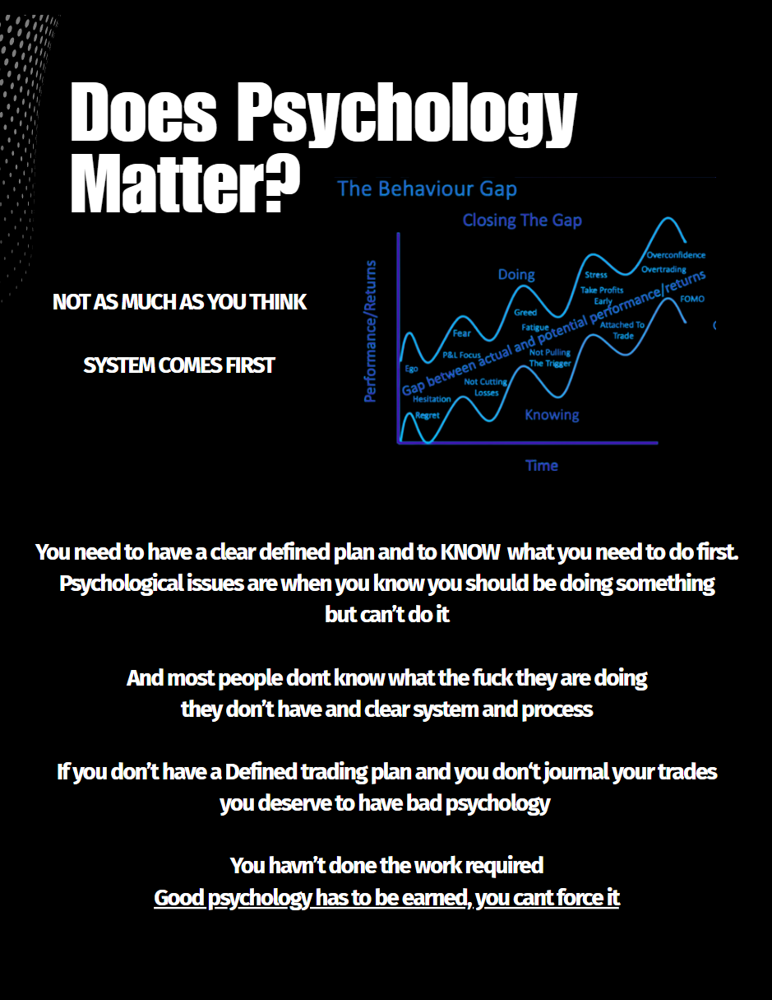

```text
Define edge
→ Validate data
→ Use tolerable risk
→ Train emotional execution
```

Many apparent psychology problems are actually clarity, evidence, risk, or system-design problems.

## 4.3 Perception–Emotion–Behavior

```text
Perception
→ Emotion
→ Behavior
→ Outcome
```

Improve by:
1. Recalibrating the interpretation that generates emotion
2. Accepting emotion without automatically acting on it

## 4.4 Emotion Classification

### Process-Based
Potentially related to current information:
- Structural deterioration
- Momentum loss
- Participation drying
- Correlation breaking
- Failure to progress

Emotion may trigger a rules-based review, not unrestricted discretion.

### Outcome-Based
Attached to:
- Protecting profit
- Avoiding loss
- Being right
- Passing
- Recovering
- Reaching a target

If market evidence has not changed, outcome urgency should not alter the plan.

## 4.5 Distress Tolerance

Tolerate normal:
- Drawdown
- Missed trades
- Uncertainty
- Boredom
- Slow growth
- Ego discomfort
- Consolidation

Avoid relief-seeking through:
- FOMO
- Overtrading
- Revenge trading
- Moving stops
- Closing early
- Increasing risk

## 4.6 Metacognition

> **Handbook source — Metacognition Explained.** Technical execution is shown as resting on actions, thoughts, beliefs and accumulated experience.

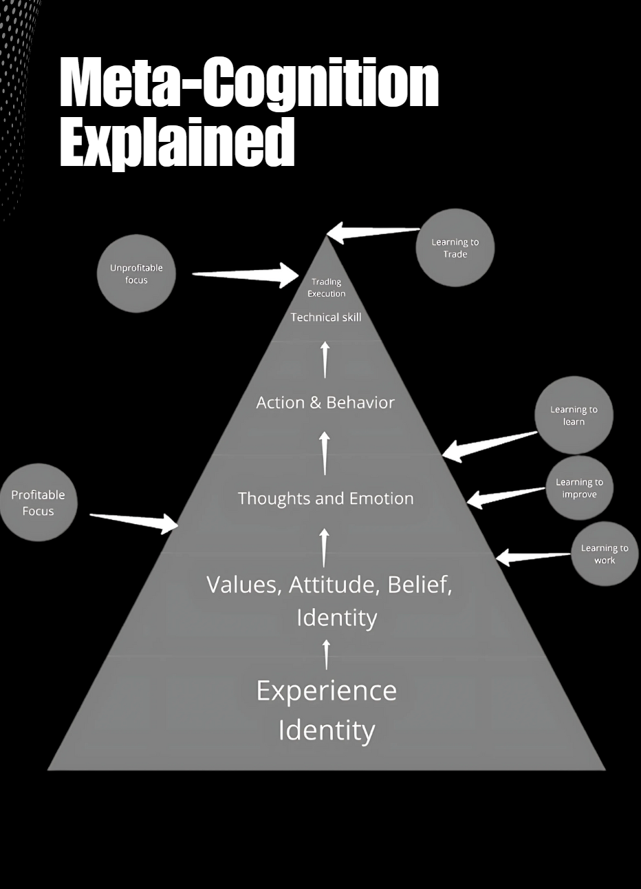

Use:
- “I notice that…”
- “I am interpreting this as…”
- “This urge is coming from…”

Create space between stimulus and action.

## 4.7 Discipline Trap

Design discipline into the environment:
- Reduce options
- Use clear rules
- Precommit
- Use if–then logic
- Mechanize shutdown
- Make the correct action easiest

Three operational mistake categories:
1. Insufficient clarity
2. Excessive complexity
3. Incorrect focus

## 4.8 Structured Disengagement

When entry, stop, target, and management are predefined and no action is required, reducing screen fixation may prevent emotional interference.

Do not disengage when active monitoring is part of the plan.

## 4.9 Identity

Do not make trade results, account status, payouts, or challenges proof of personal worth.

Build identity through repeated observable process behavior.

## 4.10 Pain-Avoidance Map

```text
Discomfort
→ Impulsive relief behavior
→ Temporary relief
→ Long-term damage
```

Examples:
- FOMO avoids regret
- Overtrading avoids boredom
- Revenge trading avoids loss/ego pain
- Moving stops avoids admitting invalidation
- Closing early avoids giving back open profit

Replacement:

```text
Discomfort
→ Awareness
→ Acceptance
→ Plan-following behavior
→ Corrective experience
```

---

# 5. System Architecture and Development

```text
FUNDAMENTALS
→ TRADING SYSTEMS
→ TRADING PLAN
→ JOURNAL
→ EDGE DEVELOPMENT
→ TECHNICAL SYSTEM
→ RISK MANAGEMENT
→ PSYCHOLOGY
→ SCALING
```

System model:

```text
Inputs
→ Process
→ Output
→ Probabilistic Outcome
→ Feedback
→ Review
→ Controlled Refinement
```

A trading plan is a testable hypothesis. Adapt between evidence windows, not after one emotional result.

Progressive validation:
1. Backtest
2. Replay
3. Forward test
4. Small live risk
5. Larger live sample
6. Scale

Backtesting supplies breadth and rapid hypothesis work. Forward testing supplies better timing, execution, and behavioral fidelity.

Clean baseline guidance:
- One strategy
- Standardized conditions
- Fixed target model
- No discretionary management
- Approximately 300 clean trades before broad optimization

Smaller samples generate hypotheses; they do not validate the edge.

Core development principles:
- Comparable repetitions
- One playbook
- Standardized environment
- Process over profit
- Data over emotion
- Remove before adding
- Diagnose before replacing
- Default to no trade
- Reverse engineer failures
- Version the plan


# 6. Journal Schema

## Identity
- Trade ID
- Date
- Instrument
- Session
- Account
- Strategy version
- Attempt number
- Tranche number

## WHAT
- Broad direction
- External/internal structure
- Condition
- Objective
- Pro/counter-direction

## WHERE
- Active move/range
- Upper/lower half
- Outer quarter
- AOI 25/50/75
- Relevant level
- Prior high/low
- Prior CBR

## HOW
- Counter-extension duration
- Arrival speed
- Cleanliness
- Participation
- Structure taken
- Correlation state

## WHEN
- Time into hour
- Hourly/30m/15m phase
- Session timing
- Initial shift
- T2
- T3 label if applicable

## ENTRY
- Entry variant
- Entry price
- Entry-50
- Breakout level
- Reason for method

## RISK
- Structural invalidation
- Stop
- Stop distance
- Risk amount/percentage
- Position size
- Combined idea risk
- Daily accumulated risk

## TARGET
- Target type
- Target price
- Planned RR

## MANAGEMENT
- Progression level
- Time to progression
- Time to expansion
- Deterioration signals
- Stop/target changes
- Partials
- Structured disengagement

## RESULT
- P&L
- Realized R
- MFE
- MAE
- Duration
- Process classification
- Loss classification

## PSYCHOLOGY
- Emotion
- Intensity
- Trigger
- Process/outcome source
- Urge
- Actual behavior
- Rule adherence
- Emotional override
- Metacognitive statement
- Post-trade reaction

Loss categories:
- Valid probabilistic loss
- Condition-change loss
- Entry-timing mistake
- Stop-placement mistake
- Management mistake
- Unqualified setup
- Risk violation
- Focus mistake
- Clarity mistake
- Complexity mistake

Do not replace descriptive analysis with one universal quality score.

---

# 7. Example Library

## Example 1 — Live Gold CBR

> **Source trade geometry — Part 1, 04:20.** Entry, structural stop and target were defined from the same CBR thesis.

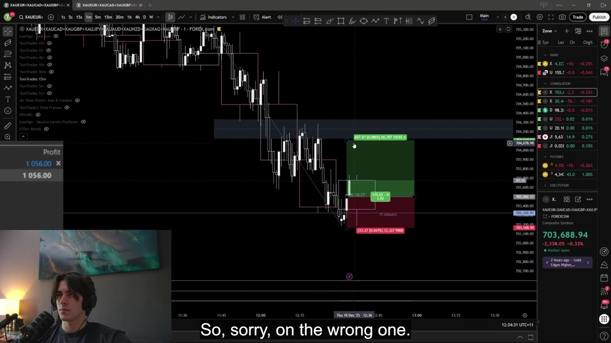

Setup:
- Broad bullish gold structure
- Immediate bearish pullback into lower half/AOI-50
- Higher-duration AOI
- Prior low swept
- Entry approximately 33 minutes into hour
- New 30-minute candle lower-wick phase
- Lower-duration bullish transition
- Stop below swept low
- Target near prior one-minute highs/upper structural area
- Approximately 1.8R

Management:
- Initial DXY conflict
- Gold breadth prioritized
- Drawdown tolerated
- New 15-minute candle lower-wick behavior
- Five-second bullish shift
- Nearby progression highs monitored
- DXY later turned bearish
- Gold expanded to target

Result: **Good trade — win**

> **Source outcome — Part 2, approximately 08:18.** Price reaches the drawn target region.

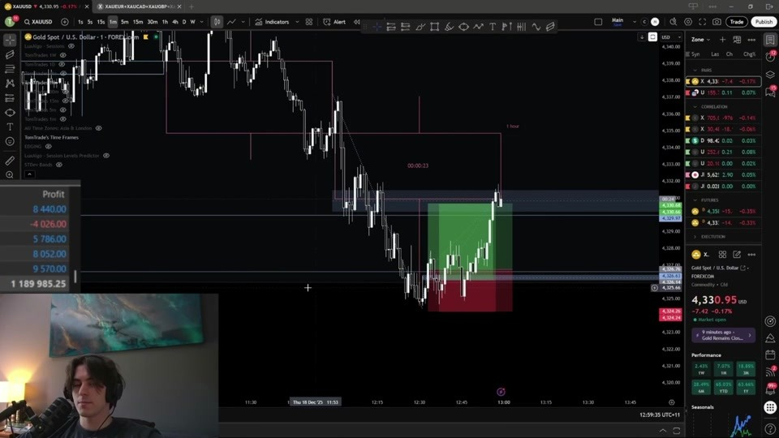

Key lessons:
- AOI touch is not entry
- Sweep requires reaction
- Correlation is graded
- Candle behavior continues after entry
- Delay reduces quality before invalidation
- Structured disengagement can prevent interference
- Scale-in risk remained undefined

## Example 2 — Five-Part Replay

Displayed test:
- $100,000 to $113,738.23
- +13.74%
- 10 trades
- 8 wins, 2 losses
- 80% win rate
- Average realized winner about 1.88R
- Small sample only

Recurring process:

```text
Condition
→ Outer location
→ Clear counter-sequence
→ High/low taken
→ Candle timing
→ Initial shift
→ Entry-50
→ T2
→ Refined execution
→ Structural stop
→ Target-50/prior structure
```

Key lessons:
- Strongest evidence for confirmed T2
- T2 entry and larger invalidation can differ
- Prior CBR may become context
- Condition may produce successive CBRs
- One loss cut early after progression failure
- One valid loss reached structural invalidation
- Winners were much faster than losers, generating a time-to-expansion hypothesis
- Hindsight MFE does not justify automatic target inflation
- Replay lacked normal correlation tools

## Example 3 — Explicit Checklist Replay

> **Literal analytics source — Part 2, 08:12.** The displayed 11-trade test ends at +15.09% with an 81.82% win rate. Treat it as a demonstration only.

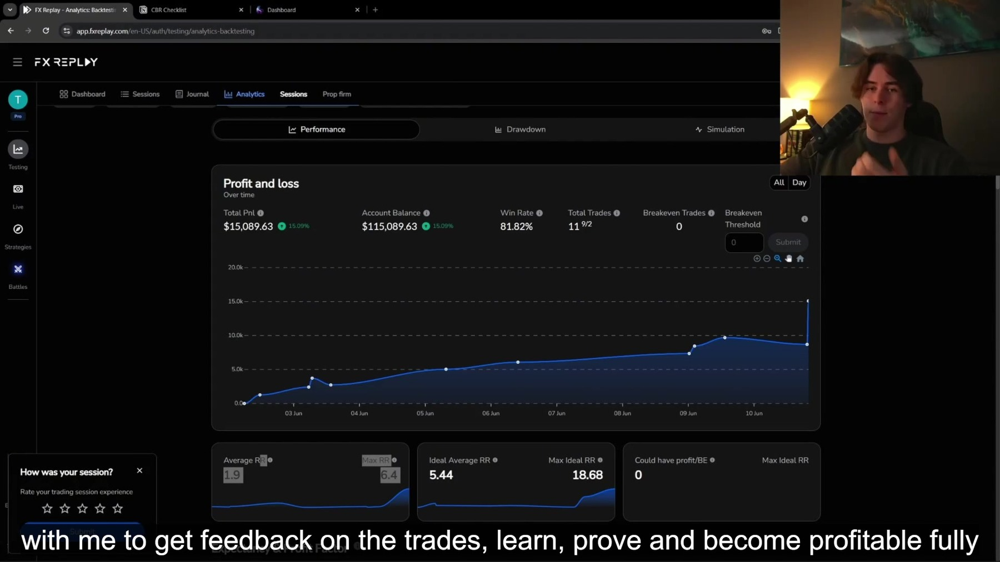

Displayed test:
- $100,000 to $115,089.63
- +15.09R
- 11 trades
- 9 wins, 2 losses
- 81.82% win rate
- Average winner about 1.90R
- Final 6.395R winner contributed about 42.4% of net profit
- Small sample only

Checklist:

```text
MTF Range
→ Outer 25%
→ Approximately 20m counter-direction overextension
→ High-participation structure into high/low
→ Entry model/T3
→ Later-hour timing
→ Entry-50 or approved breakout
```

Key lessons:
- Range is judged by rotation
- Outer quarter preferred
- Low-participation grind rejected
- Larger shifts favor Entry-50
- Candle behavior gains importance on smaller entry models
- Good condition-change loss differs from premature-entry loss
- Two attempts require risk governance
- T3 must follow the defined Phase 0 sequence
- 22–52 timing refinement remains pending
- Replay speed can reduce data quality

---

# 8. Course Module Summary

## Fundamentals
```text
Comparable repetitions
→ Reliable data
→ Accurate diagnosis
→ Faster feedback
→ Validated consistency
→ Safe scaling
```

Core:
- One playbook
- One repeatable environment
- Progressive psychological exposure
- Process over profit
- Journal system variables
- Validate before scaling
- Constrain availability
- Financial detachment
- Active learning
- Diagnose before replacing

## Trading Systems
- Inputs
- Process
- Output
- Probabilistic outcome
- Feedback
- Environment

Core:
- Output is not outcome
- Plan is a testable hypothesis
- Aggregate feedback before revision
- Externalize the process
- Standardize before optimizing
- Build an edge through evidence
- Track MFE/MAE
- Reverse engineer failure

## Technical Analysis
- Price action = movement over time
- Structure + candle behavior are primary
- Balance creates rotation
- Imbalance creates directional discovery
- External structure controls the larger thesis
- Internal structure refines execution
- Price is fractal
- Analyze duration, not only conventional timeframe labels

## Risk
- WR and RR are joint variables
- Planned RR and realized average win/loss are separate
- Equal expectancy can carry different variance
- Structural stop and target come before RR
- Position size is mental weight
- Frequency is risk
- Scale capital before forcing return

## Psychology
- System first
- Evidence before confidence
- Emotion is not failure
- Emotion is a signal, not a command
- Distress tolerance
- Metacognition
- Discipline by design
- Process focus over outcome attachment
- Identity separate from results


# 9. Protocol Index

## Foundation
F-001 Structured Skill Development; F-002 Comparable Repetition; F-003 One Playbook; F-004 Journal Variables; F-005 Short Feedback Loop; F-006 Validate Before Scaling; F-007 Progressive Psychological Exposure; F-008 Scale With Profits; F-009 Standardize Environment; F-010 Constrain Availability; F-011 Market Fit × Trader Fit; F-012 Financial Detachment; F-013 Active Learning; F-014 Diagnose Before Replacing.

## Systems
S-001 Trading System Definition; S-002 Separate Components; S-003 Review Converts Output to Intelligence; S-007 Output Is Not Outcome; S-008 Plan as Hypothesis; S-009 Aggregate Before Revision; S-010 Environment Is Part of Execution; S-011 Remove Before Adding; S-012 Strategy Is Condition-Dependent.

## Operations
O-001 Externalize Process; O-002 Comparable Trades; O-003 Comparable Repetition Before Optimization; O-004 Versioned Plan; O-005 Recorded/Reviewed Trades Create Evidence; O-006 Objective and Subjective Journal; O-007 Incremental Testing; O-008 Condition Determines Applicability; O-009 Evidence Creates Edge; O-010 Clean Baseline; O-011 Progressive Validation; O-012 Variables and Interactions; O-013 Standardize Before Optimize; O-014 Specialization; O-015 Executable Plan; O-016 Default No Trade; O-017 Build, Do Not Hunt; O-018 Signal Versus Variance; O-019 MFE/MAE; O-020 Expectancy; O-021 Labeled Experience; O-022 Good/Bad Trades; O-023 Bias and Noise; O-024 Reverse Engineer Failure; O-025 Avoid Over/Under-Refinement; O-026 Backtest Breadth vs Forward Fidelity; O-027 Control Replay Speed.

## Technical
T-037 Candle Timing; T-038 Candles Compress Structure; T-039 Control/Rejection/Commitment; T-040 Relational Candle Reading; T-041 Prior Close Hypothesis; T-042 Wick Before Expansion; T-043 Open-Relative Entry; T-044 Candle Behavior Gates Shift; T-045 Avoid Unwicked Chase; T-046 Objective-Specific Timing; T-047 Multi-Duration Alignment; T-048 Duration Over Labels; T-049 Four Questions; T-050 What; T-051 Where; T-052 How; T-053 When; T-054 Timing Windows; T-055 Do Not Chase; T-056 Separate Trending-Range Models; T-057 Three 50%s; T-058 Replay Process; T-059 CBR; T-060 Multi-Duration Timing; T-061 Deeper AOI Penetration; T-062 Sweep Requires Reaction; T-063 Correlation Modifier; T-064 Time-to-Expansion; T-065 Progression Level; T-066 Post-Entry Candle Behavior; T-067 Pre/Post Correlation; T-068 Instrument Evidence Can Outweigh General Correlation; T-069 Delayed Expansion Reduces Quality; T-070 Condition Before CBR; T-071 Reverse Counter-Sequence; T-072 Clear Arrival; T-073 Range Cleanliness; T-074 Condition Persists; T-075 Prior CBR Context; T-076 Candle Phase; T-077 Condition Target; T-078 Entry vs Invalidation; T-079 Progression Confirms; T-080 CBR Checklist; T-081 Rotational Range; T-082 Outer Quarter; T-083 Meaningful Counter-Extension; T-084 Reject Grind; T-085 Entry Depends on Geometry; T-086 Candle Behavior on Small Models; T-087 Condition Change Does Not Retroactively Invalidate.

## Risk
R-015 WR and RR Joint; R-016 Realized RR; R-017 Do Not Force Reward; R-018 RR Is Output; R-019 Equal Expectancy ≠ Equal Risk; R-020 Variance; R-021 Distribution/Psychology Fit; R-022 Avoid Mathematical Appearance; R-023 Improve RR Through Quality; R-024 Planned vs Realized; R-025 Executable Expectancy; R-026 Drawdown Boundary; R-027 Size From Stop; R-028 Fixed Fractional; R-029 No Universal Risk %; R-030 Distribution Determines Capacity; R-031 Simulator Estimate; R-032 Margin of Safety; R-033 Prop Rules Override; R-034 Position Size Is Mental Weight; R-035 Excess Risk Changes Strategy; R-036 Protect Journal; R-037 Scale Capital; R-038 Avoid Resets; R-039 Frequency Is Risk; R-040 Mental Capital; R-041 Limited Window; R-042 Quality Over Quantity; R-043 Daily Limits; R-044 Mechanical Shutdown; R-045 Do Not Rely on Willpower; R-046 Shutdown Protects Execution; R-047 Scale Capital Before Frequency; R-048 Performance by Trade Order; R-049 Decision Load; R-050 Validate Frequency; R-051 Idea-Level Scale Risk; R-052 Progression-Failure Exit; R-053 Comparative Replay Normalization; R-054 Initial-Balance Normalization.

## Psychology
P-001 Behavioral Definition; P-002 Emotion Is Not Failure; P-003 Process Override; P-004 Clarity Before Psychology; P-005 Evidence Before Confidence; P-006 Edge→Validate→Risk→Execution; P-007 Valid Losses as Expenses; P-008 Rational vs Outcome Fear; P-009 Curiosity; P-010 Bounded Intuition; P-011 Behavioral Journal; P-012 Traits as Actions; P-013 Action and Violation; P-014 Knowing vs Doing; P-015 Perception–Emotion–Behavior; P-016 Two Change Levers; P-017 Statistical Expectations; P-018 Accept Emotion; P-019 Signals Not Commands; P-020 Process vs Outcome Signal; P-021 Evidence Behind Emotion; P-022 Present Information; P-023 Metacognitive Labeling; P-024 Distress Tolerance; P-025 Avoidance Map; P-026 Process Pain; P-027 Repetition Retrains Meaning; P-028 Bottom-Up Improvement; P-029 Identity Through Evidence; P-030 Controllable Layers; P-031 Discipline by Design; P-032 Remove Options; P-033 Precommit; P-034 If–Then Rules; P-035 Observable Behavior; P-036 Minimum Necessary Complexity; P-037 Accept Trade-Offs; P-038 Diagnose Before Discipline; P-039 Mistake Source; P-040 Profit Indirectly; P-041 Protect Attention; P-042 Identity Separation; P-043 Rehearse Adversity; P-044 Score Process Separately; P-045 Adapt Between Evidence Windows; P-046 Structured Disengagement; P-047 Delay Is Not Emotional Invalidation; P-048 Hindsight Continuation Does Not Invalidate Target; P-049 Preserve Good Loss; P-050 Missed Retracement Remains Missed.

---

# 10. Glossary

- **AEGIS:** User’s trading strategy/system.
- **The Archive:** Knowledge-governance and course-reconstruction system.
- **AOI:** Area of Interest.
- **CBR:** Counter-Behavior Reversal.
- **Condition:** Range, trending range, or trend; how price progresses.
- **Direction:** Which way structure progresses.
- **External Structure:** Larger controlling structure.
- **Internal Structure:** Smaller structure inside the controlling move.
- **AOI-50:** Broader midpoint used for location.
- **Entry-50:** Midpoint of structure-breaking impulse.
- **Target-50:** Midpoint used as expected destination.
- **T2:** Confirmed nested second shift after initial shift and pullback.
- **T3:** Phase 0 confirmation sequence: take a prior high/low, immediately break the opposing prior swing, then pull back to 50% of the structure-breaking impulse.
- **Progression Level:** Nearest high/low expected to break after entry.
- **MFE:** Maximum Favorable Excursion.
- **MAE:** Maximum Adverse Excursion.
- **HVCS:** Operationally, high-participation candle sequence.
- **ER:** Operationally demonstrated as outer-range/extreme relativity; exact expansion deferred.
- **OE:** Operationally demonstrated as counter-direction overextension; exact expansion deferred.
- **IFS:** Referenced but not defined.

---

# 11. Open Items

## Genuine Unresolved Rules
- Idea-level scale-in risk
- Two-attempt risk
- Mechanical early-exit threshold
- IFS definition
- Type 1/2/3 relationship
- Formal condition-to-target matrix
- Formal correlation hierarchy
- Hard time invalidation
- Fixed-dollar live sizing process

## Intentionally Discretionary
- Range cleanliness
- Arrival quality
- Extension quality
- Participation quality
- Correlation weighting
- Level importance
- Breakout versus pullback preference
- Usable range size
- Clean versus messy sequence

## Pending Approval: T-054 Timing Refinement

Existing:
- Reversal timing around 30 minutes.

New evidence:
- Explicit CBR checklist shows 22–52 minutes.

Recommended:
- Seek CBR reversals in the later portion of the hour, approximately 22–52 minutes, with execution determined by condition, extension, candle behavior, and structure.

Status: **PROVISIONAL — AWAITING APPROVAL**

---

# 12. Research Backlog

1. T2: first shift vs Entry-50 vs T2 breakout vs T2 pullback
2. Stop: T2 swing vs larger reaction extreme
3. Timing: 0–21, 22–30, 31–40, 41–52, 53–59
4. Extension duration: under 15, 15–19, 20–29, 30+
5. Progression-failure exit variants
6. Condition target vs partial-plus-runner vs larger target
7. First, second, and later CBRs in same condition
8. Correlation alignment categories
9. One-attempt vs two-attempt risk models
10. One-entry vs fixed-total-risk scale-in models

---

# 13. Change Control

Use:

```text
CHANGE REQUEST ID:
DATE:

EXISTING PROTOCOL:

NEW EVIDENCE:

CONFLICT TYPE:
• Definition refinement
• Scope refinement
• Contradiction
• Taxonomy expansion
• Risk-governance gap
• Discretion clarification

ANALYSIS:

RECOMMENDATION:

STATUS:
• Awaiting approval
• Approved
• Rejected
• Deferred

VERSION IMPACT:
```

Never delete protocol history. Version changes.

---


# 14. Visual Source Appendix

The full source map is stored in `source_index.json`. Each image is copied from the uploaded course videos or handbook screenshots and retained in `assets/`.

| Asset | Source | Timestamp | Primary use |
|---|---|---:|---|
| `assets/01_strategy_skilltree.jpg` | 2026-07-25 00-32-30.mp4 | 00:38 | strategy architecture, What Where How When, technical/risk integration |
| `assets/02_cbr_checklist.jpg` | Example 3 part 1.mp4 | 06:40 | CBR checklist, MTF range, 25% ER |
| `assets/03_condition_vs_direction.jpg` | Condition vs Direction.mp4 | 03:07 | direction, condition, range |
| `assets/04_condition_no_trade.jpg` | Condition vs Direction.mp4 | 04:59 | unclear condition, no trade, condition persistence |
| `assets/05_candle_behavior.jpg` | Candle Behavior.mp4 | 01:14 | candle behavior, control, rejection |
| `assets/06_duration_not_timeframe.jpg` | Candle Behavior.mp4 | 12:21 | duration of price, fractal analysis, lower middle higher duration |
| `assets/07_t2_second_shift.jpg` | Example 2 part 2.mp4 | 04:00 | T2, second shift, nested shift |
| `assets/08_fractal_shift.jpg` | Entry Model.mp4 | 02:35 | fractal shift, external break, internal break |
| `assets/09_example1_entry_geometry.jpg` | Example 1 part 1.mp4 | 04:20 | live CBR, entry, structural stop |
| `assets/10_example1_target_reached.jpg` | Example 1 part 2.mp4 | ~08:18 | target reached, trade management, CBR outcome |
| `assets/11_risk_priority_drawdown.jpg` | The Maths of winning.mp4 | 01:35 | drawdown, recovery asymmetry, risk-adjusted returns |
| `assets/12_losing_streak_heatmap.jpg` | The Maths of winning.mp4 | 11:06 | losing streaks, variance, probability estimate |
| `assets/13_trade_frequency_limit.png` | Trade Frequency.mp4 | — | trade frequency, mental capital, limited trading window |
| `assets/14_daily_loss_limit.png` | Trade Frequency.mp4 | — | daily loss limit, precommitment, mechanical shutdown |
| `assets/15_psychology_system_first.png` | Psychology Handbook | — | behavior gap, system first, clarity before psychology |
| `assets/16_metacognition_pyramid.png` | Psychology Handbook | — | metacognition, identity, beliefs |
| `assets/17_example3_results.jpg` | Example 3 part 2(1).mp4 | 08:12 | small sample analytics, 11 trades, 81.82% win rate |

# 15. Version History

## 1.1.0 — 2026-07-27

- Added embedded visual source material and relative asset paths.
- Added `source_index.json` for machine retrieval.
- Corrected the literal CBR checklist transcription from `20m CE` to `20m OE`.
- Preserved the operational interpretation as approximately twenty minutes of counter-direction overextension.

## 1.0.0 — 2026-07-27

Initial consolidated master file containing:
- Executable AEGIS strategy
- CBR checklist and decision engine
- Confirmed T2
- Defined Phase 0 T3 sequence
- Risk governance
- Psychology system
- Journal schema
- Examples 1–3
- Protocol index
- Glossary
- Open items
- Research backlog
- Change control
